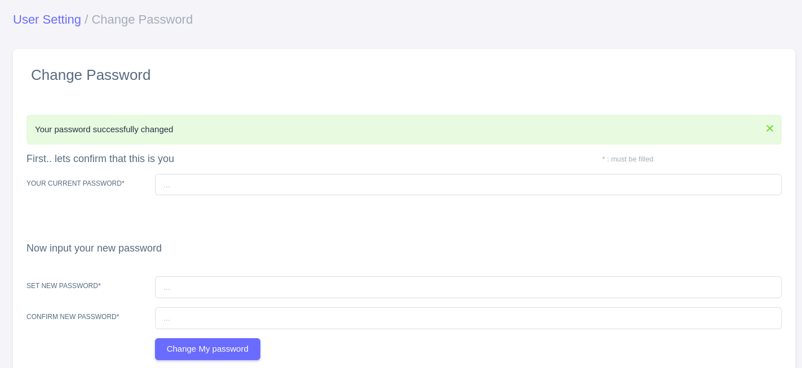
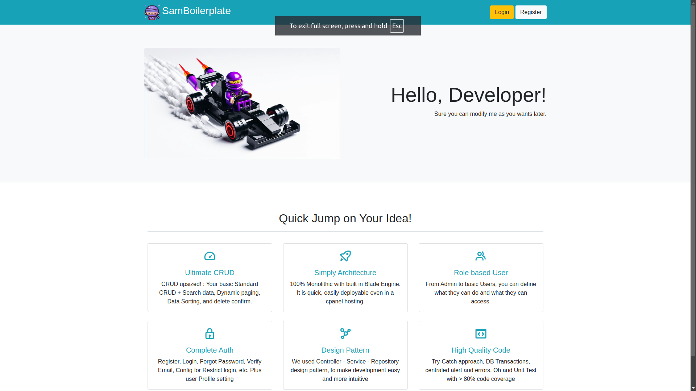

# SAMBoilerplate 11

No longer developing powerful apps from zero, SamBoilerplate is a ready-to-use foundation for building any applications which need admin-like functionality. Designed to help you get started faster without writing everything from scratch. 
This boilerplate is tailored for developers who want a solid base to customise and expand according to their needs.

[*Access the demo here*](http://samboilerplate.halokes.id)
***
Current version 11.4.1 
See our [Changelog](changelog.md)

## Key Features
1. **Ultimate CRUD**
You already know CRUD, but we level up standard CRUD into Ultimate CRUD principles. You can found the example of our Ultimate CRUD in **our EXAMPLE** for User Management features.
   - **List User** : A page which  list all of the available users. Each rows will shows basic user’s data. Along with link to detail, edit, and delete data. 
The Ultimate CRUD is this is not just a list of data. But here you can : 
     - **Search Data** : there is a search form wher you can quickly search for any user by part of their name or email.
     - **Dynamic Paging** : you can define how many data per pages, along with easy navigation between pages
     - **Sort Table** : You can sort the data by any column here, the paging and filter will be intact
   - **CreateUser** : a standard user creation
   - **Read User** : view user in more detailed than in List pages.
   - **Update User** : 
   - **Delete User** : User will be shown delete confirmation page, before he actually deletes the data. 

1. **Blade template based Engine**
I  know some of you fluent with Vue, or possibly want to use Laravel Livewire. But I understand that not all of you want them and simply just want something that works simple and fast. That’s why we use all Blade based template in here. 
1. **Admin Layout Bootstrap Themed**
Most application often need “admin template”. In here we choose Sneat AdminTemplate which based on Bootstrap Framework. 
1. **Modern Design Pattern**
We follow modern design in software development : Controller Service Repository. Separating request handling from logic and from DB layer. 
1. **Queue Email Delivery**
Get rid of blocking journey using queue. The auth email delivery is now use Queue. Simply change the queue=sync to 'database' or any your queue choice
1. **Unit Test**
Yeah, we already implement some the unit test which you can simply run with “php artisan test” as usual. or with “php artisan test –coverage” to get code coverage. We set our standard to be above 80% code coverage (currently 90%+) code coverage. 
1. **Complete Authentication (Auth)**  :
The authentication system basically uses Laravel Breeze, but fully modified to work with Blade templates instead of the default Vite, providing a more straightforward template management experience. Some Pre-built features include : 
    - Login page,
   - Register Page, 
   - Email Verification
   - Password Reset
1. **Role Based User Authentication**
A user is defined by its roles. A user can have multiple roles. Any routes or a blade features can be protected or be shown based on roles that a user has. Default setup have 4 roles, admin, supervisor, operator, and user. There is also an example of a super admin user where you can have all of these roles at once!
1. **Easy Configuration**
We put most of configuration setting in constant.php You can configure like if users need to verify their email before able to login, or if a newly registered user is not able to login until an admin activate his account, etc.
1.   **Others** : Change User Profiles, change password,  Print Preview, Deactivate account, UI samples, etc. 


***
## Getting Started

To run this application, you need the following:

- **PHP 8.2 or higher** (I personally Recommend: PHP 8.3 or higher)
- PHP extensions required by Laravel:
  - `mbstring`, `xml`, `curl`, `mysql`, `zip`, `bcmath`, `json`, `gd`
- **Composer**: [Install Composer](https://getcomposer.org/)
- **MySQL** (or another database of your choice)

### Example Installation (Ubuntu with PHP 8.3):

```bash
sudo apt update
sudo apt install php8.3 php8.3-cli php8.3-mbstring php8.3-xml php8.3-curl php8.3-mysql php8.3-zip php8.3-bcmath php8.3-json php8.3-gd
```

### Initial Setup : 
1. In your terminal run
```bash
composer install
```

2. copy .env.example into .env files, then configure your database setting there

3. In your terminal run again : 
```
php artisan key:generate
php artisan migrate:fresh && php artisan db:seed
```
1. SamBoilerplate 11 now should be ready. 

*(Optional) If you want to populate the User with around 100 sample of user data run*
```bash
php artisan db:seed --class=FakeUserSeeder
```

### Running : 
1. In your terminal run : 
```bash
php artisan serve
```

2. Then you can access it in : `http://localhost:8000` via your browser 

3. The `8000` is depend on you configuration port. If you want to run in another port (e.g. port 9999) you can run : 

```bash
php artisan serve --port=9999
```

### Testing:

```bash
php artisan test
```

Or if you want to produce code coverage 

```bash
php artisan test –coverage
```


***

# Default Credentials
There are 4 roles and 5 default users if you run `php artisan db:seed` as above. 
After seeding the database, the following default users will be available:

| Email                         | Role                                                  | Password        |
| ----------------------------- | ----------------------------------------------------- | --------------- |
| superadmin@panganaman.id | ROLE_ADMIN, ROLE_SUPERVISOR, ROLE_OPERATOR, ROLE_USER | *`password123`* |
| admin@panganaman.id      | ROLE_ADMIN, ROLE_USER                                 | *`password123`* |
| supervisor@panganaman.id | ROLE_SUPERVISOR, ROLE_USER                            | *`password123`* |
| operator@panganaman.id   | ROLE_OPERATOR, ROLE_USER                              | *`password123`* |
| user@panganaman.id       | ROLE_USER                                             | *`password123`* |


- Only admin and superadmin which has ROLE_ADMIN roles. 
- ALL user above has ROLE_USER by default. 
- A user can have none to all roles available
- User superadmin can access anything since he has ALL THE ROLES!

#### Role in Routing
You can restrict certain action based on Role on the routes files. Below is the example how to restric certain routes only able to be accessed by ROLE_ADMIN
```php
// this route only able to be accessed by ROLE_ADMIn
    Route::prefix('/admin')
        ->middleware('role:ROLE_ADMIN')
        ->group(function () {
            Route::get('/user',                     [UserController::class, 'index'])->name('admin.user.index');
            Route::get('/user/add/new',             [UserController::class, 'create'])->name('admin.user.add');
            Route::post('/user/add/new',            [UserController::class, 'store'])->name('admin.user.store');
            //......
        });

// this route only able to be accessed by ROLE_SUPERVISOR
Route::get('/supervisor-page', [SupervisorController::class, 'index']) ->name('supervisor-page')->middleware('role:ROLE_SUPERVISOR');

```

#### Role in Blade Templating
You can make certain part of blade only shown in certain role. Look at the `sidebar.blade.php` if you want to deep dive. Here are the examples. 

```php
//make menu only visible if user has ROLE_OPERATOR
  @if (auth()->user()->hasRole('ROLE_OPERATOR'))
    @include('admin.components.sidebar.menu-header', ['textMenuHeader' => 'Operator Menu'])
    @include('admin.components.sidebar.item', [
      'menuId' => 'menu-operator-pages',
      'menuText' => 'Operator',
      'menuUrl' => route('operator-page'),
      'menuIcon' => 'bx bx-train',
      'subMenuData' => null,
  ])
@endif
```


# Code Structure

## Routing
There are two main routes in this code
- `web.php` -> *for non auth routing*
- `auth.php` -> *for auth related routing*

## Enabling Queue: 
On .env change 

```bash
QUEUE_CONNECTION=sync
```

Into

```bash
QUEUE_CONNECTION=database
```

Please Note that you need queue worker to run the queue 
Like 

```bash
php artisan queue:listen
```

or 
```bash
php artisan queue:work
```

## Important Configuration:
Most configuration in this SamBoilerplate is placed in file `constant.php` in config folder. 
- By default new registered user via register route will be assigned `ROLE_USER` roles. If you need something else, change the `NEW_USER_DEFAULT_ROLES` variable.
- By default all user new registered user via register route will be assigned `is_active` TRUE which enabled them to login. If you want to change it, change `NEW_USER_STATUS_ACTIVE` 
- By default all user new registered user via register route able to login even if their email is not verified. To change this setting, set on file  `NEW_USER_NEED_VERIFY_EMAIL` 

## Design Pattern
I write most of the code here in following structures
`Controller -> Service -> Repository`
- Repository handles the data modelling
- Service handles the 'business' logic
- Controller handles the Validation and request handling, also with view logic, about what to be shown in View. 

An example of use case is like in User CRUD, there is 
- UserController.php
- UserService.php
- UserRepository.php

the flow is (more or less) like as follows
`Request -> UserController -> UserService -> UserRepository -> DB` 
But **not all** function use this. Sometimes it is just UserController and then direct to View, especially if no business logic or database related operation hapen. 

### Try Catch Exception
I am used to use try catch exception in many of my projects. Including this SamBoilerplate. You may found here. Most of the time I simply throw and catch generic `Exception` but in some, you may found some "custom" Exception like `IncorrectPasswordException`

### DB Transaction
For some operation which requires a bit 'complicated operation', I put DB transactions in them. Feel free to modify based on you want (e.g. move the transaction from controller to service or vice versa) 


### Helper class
there are two classes related to helper
- `AlertHelper` -> relates to 'wrap' the alert messages (the around red or green box in tops of any form)
- `ErrorHelper` -> relates to centralized error message management, if you want to use this (very usefull if you make API related)

## License Notes
My code is mostly on Laravel side. However, most of the UI here is using Sneat Theme. I use the free version of theirs so I still put the credit on the footer of any pages. 
Buying my license didn't mean you buy their license. Please check their license plan in 

***
## Key Features Of SamBoilerplate 11

### Ultimate CRUD
You already know CRUD, but we level up standard CRUD into **Ultimate CRUD** principles. You can find the example of our Ultimate CRUD in our example for **User Management Ultimate CRUD**.

- **List Pages**: A page that lists all available users. Each row shows basic user data, along with links to view, edit, and delete data.
- The Ultimate CRUD is not just a list of data. Here you can:
  - **Search Data**: There is a search form where you can quickly search for any user by part of their name or email.
  - **Dynamic Paging**: You can define how many items per page, along with easy navigation between pages.
  - **Sortable**: You can sort the data by any column.
  - **Create User**: A standard user creation functionality.
  - **Read User**: View user details in more detail than on the list pages.
  - **Update User**: Update user information.
  - **Delete User**: A delete confirmation page will be shown before actually deleting the data.

### Blade Template Based Engine
I know some of you are fluent with Vue or possibly want to use Laravel Livewire. However, I understand that not everyone wants them and simply desires something that works simply and fast. That’s why we use a Blade-based template here.

### Admin Layout Bootstrap Themed
Most applications often need an “admin template.” Here, we chose the **Sneat Admin Template**, which is based on the Bootstrap framework.

### Modern Design Pattern
We follow modern design in software development: **Controller-Service-Repository**. This pattern separates request handling from business logic and the database layer.

### Queue Email Delivery
For two functionalities in our authentication system—email verification and password reset—we have implemented a queue for email handling instead of synchronous processing. 

### Unit Test
Yes, we have implemented unit tests that you can simply run with `php artisan test` or with `php artisan test --coverage` to get code coverage. We set our standard to be above 80% code coverage (currently 90%+).

### Authentication (Auth)
The authentication system primarily uses **Laravel Breeze**, fully modified to work with Blade templates instead of the default Vite, providing a more straightforward template management experience. Some pre-built features include:
- Login page
- Register page
- Email verification
- Password reset

Email handling (e.g., password reset emails) utilizes the queue system for better performance but can also be switched to synchronous mode if your server doesn’t support queues.

### Role-Based User Authentication
A user is defined by their roles. A user can have multiple roles, and any routes or Blade features can be protected or displayed based on the roles a user has. The default setup has four roles: admin, supervisor, operator, and user. There is also an example of a super admin user who can have all of these roles at once!

### Easy Configuration
We place most configuration settings in `constant.php`. You can configure whether users need to verify their email before being able to log in or if a newly registered user cannot log in until an admin activates their account, etc. 

Change user profiles, print preview, deactivate account, UI samples, etc.

## Why This Boilerplate is Right for You:

- **Save Time**: All the basic features are ready to go, so you don’t have to rewrite common functions like login, registration, or user management.
- **Beginner-Friendly**: The code is organized in a way that’s easy to understand, even if you’re just starting out with Laravel.
- **Comprehensive Documentation**: Step-by-step documentation to guide you through understanding and extending the features.

With this boilerplate, you can focus on developing the core features of your application without wasting time building the basics from scratch. It's ideal for anyone looking to quickly build a feature-rich admin application!

## Showcase

<!--========================== AUTH SYSTEM IS HERE ==========================  -->
### Auth system
Here is some showcase related to Auth

#### User Registration

##### After Register need Email Verification

##### After Register but Need Admin activation

##### After Register but Need Admin activation and Email verification


#### Login

##### Login Email not verified


### Email Verification
##### Resend email verification


##### Resend Email verification success


##### Email 


#### Forgot Password

##### Forgot password send success


<!--========================== DASHBOARD AND NAVIGATION ==========================  -->

## Dashboard and Navigation
Things you will find when you successfully login
### Dashboard

### Top Right Menu

### Sidebar


## Ultimate CRUD Example : User Management
Showcase on ultimate CRUD in User management examples
### List User (with fake data)


#### Search User


#### Sort User by Name Descending


#### Dynamic Per-Page Paging


#### Paging Page Element


### View / Detail User


### Add User


### Edit User


#### Edit User - validation error


### Delete User
#### Confirm Before Delete

#### Delete Success


## User Profile
#### New User has no Profile

#### Filling User Profile form

#### Update user profile Success

#### User Profile - incorrect change image


## User Setting
### Change Password

#### Change Password success

### Deactivate Accounts

#### Deactivate Accounts - mandatory checkbox

#### Deactivate Accounts - success


## Others
### Demo Print pages 
When you might need preview or print at the same time


### UI Samples 
These UI samples all from the theme. You can see more on their site. See our footer for their themes.
#### Demo UI Cards

#### Demo UI Table

#### Demo UI Form 1

#### Demo UI Form 2

#### Demo UI Blank


## Landing Pages
SamBoilerplate mostly is about admin / back office pages. This landing page is just a bonus



## Code Quality and Test Unit
Coding style (I love comments!)

Run your Unit test

Our minimum Quality Standard is 80% Code Coverage


---
## Thank You
and lets build great apps!
