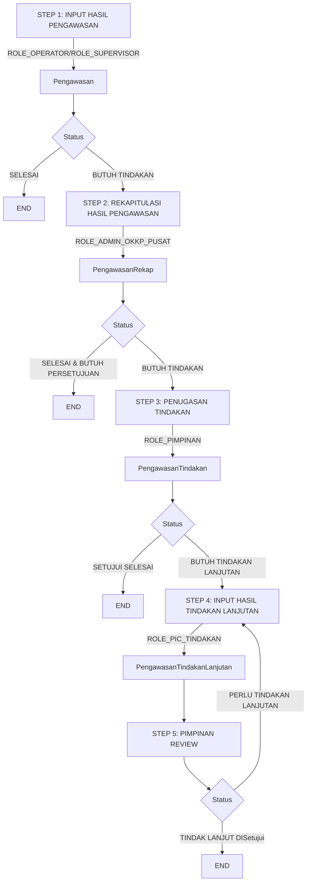

# Pengawasan Feature Implementation Plan

## Overview
This document outlines the complete implementation plan for the pengawasan (supervision) feature that will be used by ROLE_OPERATOR and ROLE_SUPERVISOR users.

## Database Schema Design

### 1. Core Tables

#### Table: pengawasan
```sql
CREATE TABLE pengawasan (
    id VARCHAR(36) PRIMARY KEY,
    user_id_initiator VARCHAR(36) NOT NULL,
    lokasi_alamat TEXT,
    lokasi_kota_id VARCHAR(36),
    lokasi_provinsi_id VARCHAR(36),
    tanggal_mulai DATE,
    tanggal_selesai DATE,
    jenis_psat_id VARCHAR(36) NOT NULL,
    produk_psat_id VARCHAR(36) NOT NULL,
    hasil_pengawasan TEXT,
    status ENUM('SELESAI', 'BUTUH_TINDAKAN') NOT NULL,
    tindakan_rekomendasikan TEXT,
    is_active BOOLEAN DEFAULT TRUE,
    created_by VARCHAR(36),
    updated_by VARCHAR(36),
    created_at TIMESTAMP DEFAULT CURRENT_TIMESTAMP,
    updated_at TIMESTAMP DEFAULT CURRENT_TIMESTAMP ON UPDATE CURRENT_TIMESTAMP,
    deleted_at TIMESTAMP NULL,
    
    FOREIGN KEY (user_id_initiator) REFERENCES users(id),
    FOREIGN KEY (jenis_psat_id) REFERENCES master_jenis_pangan_segars(id),
    FOREIGN KEY (produk_psat_id) REFERENCES master_bahan_pangan_segars(id),
    FOREIGN KEY (lokasi_kota_id) REFERENCES master_kotas(id),
    FOREIGN KEY (lokasi_provinsi_id) REFERENCES master_provinsis(id),
    FOREIGN KEY (created_by) REFERENCES users(id),
    FOREIGN KEY (updated_by) REFERENCES users(id)
);
```

#### Table: pengawasan_rekap
```sql
CREATE TABLE pengawasan_rekap (
    id VARCHAR(36) PRIMARY KEY,
    pengawasan_id VARCHAR(36) NOT NULL,
    user_id_admin VARCHAR(36) NOT NULL,
    jenis_psat_id VARCHAR(36) NOT NULL,
    produk_psat_id VARCHAR(36) NOT NULL,
    hasil_rekap TEXT,
    status ENUM('SELESAI_BUTUH_PERSETUJUAN', 'BUTUH_TINDAKAN') NOT NULL,
    pic_tindakan_id VARCHAR(36),
    is_active BOOLEAN DEFAULT TRUE,
    created_by VARCHAR(36),
    updated_by VARCHAR(36),
    created_at TIMESTAMP DEFAULT CURRENT_TIMESTAMP,
    updated_at TIMESTAMP DEFAULT CURRENT_TIMESTAMP ON UPDATE CURRENT_TIMESTAMP,
    deleted_at TIMESTAMP NULL,
    
    FOREIGN KEY (pengawasan_id) REFERENCES pengawasan(id),
    FOREIGN KEY (user_id_admin) REFERENCES users(id),
    FOREIGN KEY (jenis_psat_id) REFERENCES master_jenis_pangan_segars(id),
    FOREIGN KEY (produk_psat_id) REFERENCES master_bahan_pangan_segars(id),
    FOREIGN KEY (pic_tindakan_id) REFERENCES users(id),
    FOREIGN KEY (created_by) REFERENCES users(id),
    FOREIGN KEY (updated_by) REFERENCES users(id)
);
```

#### Table: pengawasan_tindakan
```sql
CREATE TABLE pengawasan_tindakan (
    id VARCHAR(36) PRIMARY KEY,
    pengawasan_rekap_id VARCHAR(36) NOT NULL,
    user_id_pimpinan VARCHAR(36) NOT NULL,
    tindak_lanjut TEXT,
    status ENUM('SETUJUI_SELESAI', 'BUTUH_TINDAKAN_LANJUTAN') NOT NULL,
    pic_tindakan_ids JSON, -- Array of user IDs
    is_active BOOLEAN DEFAULT TRUE,
    created_by VARCHAR(36),
    updated_by VARCHAR(36),
    created_at TIMESTAMP DEFAULT CURRENT_TIMESTAMP,
    updated_at TIMESTAMP DEFAULT CURRENT_TIMESTAMP ON UPDATE CURRENT_TIMESTAMP,
    deleted_at TIMESTAMP NULL,
    
    FOREIGN KEY (pengawasan_rekap_id) REFERENCES pengawasan_rekap(id),
    FOREIGN KEY (user_id_pimpinan) REFERENCES users(id),
    FOREIGN KEY (created_by) REFERENCES users(id),
    FOREIGN KEY (updated_by) REFERENCES users(id)
);
```

#### Table: pengawasan_tindakan_lanjutan
```sql
CREATE TABLE pengawasan_tindakan_lanjutan (
    id VARCHAR(36) PRIMARY KEY,
    pengawasan_tindakan_id VARCHAR(36) NOT NULL,
    user_id_pic VARCHAR(36) NOT NULL,
    tindak_lanjut TEXT,
    status ENUM('DIAJUKAN_PERSETUJUAN', 'DISetujui', 'PERLU_TINDAKAN_LANJUTAN') NOT NULL,
    is_active BOOLEAN DEFAULT TRUE,
    created_by VARCHAR(36),
    updated_by VARCHAR(36),
    created_at TIMESTAMP DEFAULT CURRENT_TIMESTAMP,
    updated_at TIMESTAMP DEFAULT CURRENT_TIMESTAMP ON UPDATE CURRENT_TIMESTAMP,
    deleted_at TIMESTAMP NULL,
    
    FOREIGN KEY (pengawasan_tindakan_id) REFERENCES pengawasan_tindakan(id),
    FOREIGN KEY (user_id_pic) REFERENCES users(id),
    FOREIGN KEY (created_by) REFERENCES users(id),
    FOREIGN KEY (updated_by) REFERENCES users(id)
);
```

#### Table: pengawasan_attachment
```sql
CREATE TABLE pengawasan_attachment (
    id VARCHAR(36) PRIMARY KEY,
    linked_id VARCHAR(36) NOT NULL,
    linked_type ENUM('PENGAWASAN', 'REKAP', 'TINDAKAN', 'TINDAKAN_LANJUTAN') NOT NULL,
    file_path VARCHAR(255) NOT NULL,
    file_name VARCHAR(255) NOT NULL,
    file_type VARCHAR(100),
    file_size BIGINT,
    is_active BOOLEAN DEFAULT TRUE,
    created_by VARCHAR(36),
    created_at TIMESTAMP DEFAULT CURRENT_TIMESTAMP,
    
    FOREIGN KEY (created_by) REFERENCES users(id)
);
```

#### Table: pengawasan_tindakan_pic (Pivot Table)
```sql
CREATE TABLE pengawasan_tindakan_pic (
    tindakan_id VARCHAR(36),
    pic_id VARCHAR(36),
    created_at TIMESTAMP DEFAULT CURRENT_TIMESTAMP,
    updated_at TIMESTAMP DEFAULT CURRENT_TIMESTAMP ON UPDATE CURRENT_TIMESTAMP,
    
    FOREIGN KEY (tindakan_id) REFERENCES pengawasan_tindakan(id),
    FOREIGN KEY (pic_id) REFERENCES users(id),
    
    PRIMARY KEY (tindakan_id, pic_id)
);
```

## Laravel Models

### 1. Pengawasan Model
```php
<?php
namespace App\Models;

use Illuminate\Database\Eloquent\Model;
use Illuminate\Database\Eloquent\SoftDeletes;
use Illuminate\Database\Eloquent\Concerns\HasUuids;

class Pengawasan extends Model
{
    use HasUuids, SoftDeletes;
    
    protected $table = 'pengawasan';
    protected $primaryKey = 'id';
    public $incrementing = false;
    protected $keyType = 'string';
    
    protected $fillable = [
        'user_id_initiator',
        'lokasi_alamat',
        'lokasi_kota_id',
        'lokasi_provinsi_id',
        'tanggal_mulai',
        'tanggal_selesai',
        'jenis_psat_id',
        'produk_psat_id',
        'hasil_pengawasan',
        'status',
        'tindakan_rekomendasikan',
        'is_active',
        'created_by',
        'updated_by',
    ];
    
    public function initiator()
    {
        return $this->belongsTo(User::class, 'user_id_initiator');
    }
    
    public function jenisPsat()
    {
        return $this->belongsTo(MasterJenisPanganSegar::class, 'jenis_psat_id');
    }
    
    public function produkPsat()
    {
        return $this->belongsTo(MasterBahanPanganSegar::class, 'produk_psat_id');
    }
    
    public function rekap()
    {
        return $this->hasOne(PengawasanRekap::class);
    }
    
    public function attachments()
    {
        return $this->hasMany(PengawasanAttachment::class, 'linked_id')
            ->where('linked_type', 'PENGAWASAN');
    }
}
```

### 2. PengawasanRekap Model
```php
<?php
namespace App\Models;

use Illuminate\Database\Eloquent\Model;
use Illuminate\Database\Eloquent\SoftDeletes;
use Illuminate\Database\Eloquent\Concerns\HasUuids;

class PengawasanRekap extends Model
{
    use HasUuids, SoftDeletes;
    
    protected $table = 'pengawasan_rekap';
    protected $primaryKey = 'id';
    public $incrementing = false;
    protected $keyType = 'string';
    
    protected $fillable = [
        'pengawasan_id',
        'user_id_admin',
        'jenis_psat_id',
        'produk_psat_id',
        'hasil_rekap',
        'status',
        'pic_tindakan_id',
        'is_active',
        'created_by',
        'updated_by',
    ];
    
    public function pengawasan()
    {
        return $this->belongsTo(Pengawasan::class);
    }
    
    public function admin()
    {
        return $this->belongsTo(User::class, 'user_id_admin');
    }
    
    public function jenisPsat()
    {
        return $this->belongsTo(MasterJenisPanganSegar::class, 'jenis_psat_id');
    }
    
    public function produkPsat()
    {
        return $this->belongsTo(MasterBahanPanganSegar::class, 'produk_psat_id');
    }
    
    public function lokasiKota()
    {
        return $this->belongsTo(MasterKota::class, 'lokasi_kota_id');
    }
    
    public function lokasiProvinsi()
    {
        return $this->belongsTo(MasterProvinsi::class, 'lokasi_provinsi_id');
    }
    
    public function picTindakan()
    {
        return $this->belongsTo(User::class, 'pic_tindakan_id');
    }
    
    public function tindakan()
    {
        return $this->hasOne(PengawasanTindakan::class);
    }
    
    public function attachments()
    {
        return $this->hasMany(PengawasanAttachment::class, 'linked_id')
            ->where('linked_type', 'REKAP');
    }
}
```

### 3. PengawasanTindakan Model
```php
<?php
namespace App\Models;

use Illuminate\Database\Eloquent\Model;
use Illuminate\Database\Eloquent\SoftDeletes;
use Illuminate\Database\Eloquent\Concerns\HasUuids;

class PengawasanTindakan extends Model
{
    use HasUuids, SoftDeletes;
    
    protected $table = 'pengawasan_tindakan';
    protected $primaryKey = 'id';
    public $incrementing = false;
    protected $keyType = 'string';
    
    protected $fillable = [
        'pengawasan_rekap_id',
        'user_id_pimpinan',
        'tindak_lanjut',
        'status',
        'pic_tindakan_ids',
        'is_active',
        'created_by',
        'updated_by',
    ];
    
    protected $casts = [
        'pic_tindakan_ids' => 'array',
    ];
    
    public function rekap()
    {
        return $this->belongsTo(PengawasanRekap::class);
    }
    
    public function pimpinan()
    {
        return $this->belongsTo(User::class, 'user_id_pimpinan');
    }
    
    public function picTindakans()
    {
        return $this->belongsToMany(User::class, 'pengawasan_tindakan_pic', 'tindakan_id', 'pic_id');
    }
    
    public function tindakanLanjutan()
    {
        return $this->hasOne(PengawasanTindakanLanjutan::class);
    }
    
    public function attachments()
    {
        return $this->hasMany(PengawasanAttachment::class, 'linked_id')
            ->where('linked_type', 'TINDAKAN');
    }
}
```

### 4. PengawasanTindakanLanjutan Model
```php
<?php
namespace App\Models;

use Illuminate\Database\Eloquent\Model;
use Illuminate\Database\Eloquent\SoftDeletes;
use Illuminate\Database\Eloquent\Concerns\HasUuids;

class PengawasanTindakanLanjutan extends Model
{
    use HasUuids, SoftDeletes;
    
    protected $table = 'pengawasan_tindakan_lanjutan';
    protected $primaryKey = 'id';
    public $incrementing = false;
    protected $keyType = 'string';
    
    protected $fillable = [
        'pengawasan_tindakan_id',
        'user_id_pic',
        'tindak_lanjut',
        'status',
        'is_active',
        'created_by',
        'updated_by',
    ];
    
    public function tindakan()
    {
        return $this->belongsTo(PengawasanTindakan::class);
    }
    
    public function pic()
    {
        return $this->belongsTo(User::class, 'user_id_pic');
    }
    
    public function attachments()
    {
        return $this->hasMany(PengawasanAttachment::class, 'linked_id')
            ->where('linked_type', 'TINDAKAN_LANJUTAN');
    }
}
```

### 5. PengawasanAttachment Model
```php
<?php
namespace App\Models;

use Illuminate\Database\Eloquent\Model;
use Illuminate\Database\Eloquent\SoftDeletes;
use Illuminate\Database\Eloquent\Concerns\HasUuids;

class PengawasanAttachment extends Model
{
    use HasUuids, SoftDeletes;
    
    protected $table = 'pengawasan_attachment';
    protected $primaryKey = 'id';
    public $incrementing = false;
    protected $keyType = 'string';
    
    protected $fillable = [
        'linked_id',
        'linked_type',
        'file_path',
        'file_name',
        'file_type',
        'file_size',
        'is_active',
        'created_by',
    ];
    
    public function createdBy()
    {
        return $this->belongsTo(User::class, 'created_by');
    }
}
```

## Integration with Existing Models

The pengawasan feature integrates with the following existing models:

### 1. MasterProvinsi Model
- **Table**: `master_provinsis`
- **Relationship**: Used for location tracking in pengawasan records
- **Integration**: `Pengawasan` model has a `lokasiProvinsi()` relationship
- **Fields**: `id`, `kode_provinsi`, `nama_provinsi`

### 2. MasterKota Model
- **Table**: `master_kotas`
- **Relationship**: Used for location tracking in pengawasan records
- **Integration**:
  - `Pengawasan` model has a `lokasiKota()` relationship
  - `MasterKota` has a `provinsi()` relationship to `MasterProvinsi`
- **Fields**: `id`, `provinsi_id`, `kode_kota`, `nama_kota`

### 3. MasterJenisPanganSegar Model
- **Table**: `master_jenis_pangan_segars`
- **Relationship**: Used for PSAT type selection
- **Integration**:
  - `Pengawasan` model has a `jenisPsat()` relationship
  - `PengawasanRekap` model has a `jenisPsat()` relationship
- **Fields**: `id`, `kelompok_id`, `kode_jenis_pangan_segar`, `nama_jenis_pangan_segar`

### 4. MasterBahanPanganSegar Model
- **Table**: `master_bahan_pangan_segars`
- **Relationship**: Used for PSAT product selection
- **Integration**:
  - `Pengawasan` model has a `produkPsat()` relationship
  - `PengawasanRekap` model has a `produkPsat()` relationship
- **Fields**: `id`, `jenis_id`, `nama_bahan_pangan_segar`

### 5. User Model
- **Table**: `users`
- **Relationship**: Used for user tracking throughout the process
- **Integration**:
  - `Pengawasan` has `initiator()` relationship
  - `PengawasanRekap` has `admin()` relationship
  - `PengawasanTindakan` has `pimpinan()` relationship
  - `PengawasanTindakanLanjutan` has `pic()` relationship
- **Fields**: `id`, `name`, `email`, `roles`

## Workflow Configuration Updates

Update `config/workflow.php` to include pengawasan workflow types:

```php
'pengawasan_statuses' => [
    'DIAWASI' => 'Diawasi',
    'DIREKAP' => 'Direkap',
    'TINDAKAN_DIBUAT' => 'Tindakan Dibuat',
    'TINDAKAN_LANJUTAN_DIAJUKAN' => 'Tindakan Lanjutan Diajukan',
    'TINDAKAN_LANJUTAN_DISetujui' => 'Tindakan Lanjutan Disetujui',
    'SELESAI' => 'Selesai',
],

'pengawasan_types' => [
    'PENGAWASAN' => 'Pengawasan',
    'REKAPITULASI' => 'Rekapitulasi',
    'TINDAKAN' => 'Tindakan',
    'TINDAKAN_LANJUTAN' => 'Tindakan Lanjutan',
],
```

## Implementation Flow



## Migration Files to Create

1. `2025_08_19_140000_create_pengawasan_table.php`
2. `2025_08_19_140100_create_pengawasan_rekap_table.php`
3. `2025_08_19_140200_create_pengawasan_tindakan_table.php`
4. `2025_08_19_140300_create_pengawasan_tindakan_lanjutan_table.php`
5. `2025_08_19_140400_create_pengawasan_attachment_table.php`
6. `2025_08_19_140500_create_pengawasan_tindakan_pic_table.php`

## Controllers to Create

1. `PengawasanController` - For STEP 1
2. `PengawasanRekapController` - For STEP 2
3. `PengawasanTindakanController` - For STEP 3
4. `PengawasanTindakanLanjutanController` - For STEP 4
5. `PengawasanReviewController` - For STEP 5

## Routes to Add

```php
// Pengawasan routes
Route::middleware(['auth', 'role:ROLE_OPERATOR|ROLE_SUPERVISOR'])->group(function () {
    Route::get('/pengawasan', [PengawasanController::class, 'index'])->name('pengawasan.index');
    Route::get('/pengawasan/create', [PengawasanController::class, 'create'])->name('pengawasan.create');
    Route::post('/pengawasan', [PengawasanController::class, 'store'])->name('pengawasan.store');
    Route::get('/pengawasan/{id}', [PengawasanController::class, 'show'])->name('pengawasan.show');
    Route::get('/pengawasan/{id}/edit', [PengawasanController::class, 'edit'])->name('pengawasan.edit');
    Route::put('/pengawasan/{id}', [PengawasanController::class, 'update'])->name('pengawasan.update');
});

// Pengawasan Rekap routes
Route::middleware(['auth', 'role:ROLE_ADMIN_OKKP_PUSAT'])->group(function () {
    Route::get('/pengawasan/rekap', [PengawasanRekapController::class, 'index'])->name('pengawasan.rekap.index');
    Route::get('/pengawasan/rekap/create', [PengawasanRekapController::class, 'create'])->name('pengawasan.rekap.create');
    Route::post('/pengawasan/rekap', [PengawasanRekapController::class, 'store'])->name('pengawasan.rekap.store');
    // ... other CRUD routes
});

// Pengawasan Tindakan routes
Route::middleware(['auth', 'role:ROLE_PIMPINAN'])->group(function () {
    Route::get('/pengawasan/tindakan', [PengawasanTindakanController::class, 'index'])->name('pengawasan.tindakan.index');
    // ... other CRUD routes
});

// Pengawasan Tindakan Lanjutan routes
Route::middleware(['auth'])->group(function () {
    Route::get('/pengawasan/tindakan-lanjutan', [PengawasanTindakanLanjutanController::class, 'index'])->name('pengawasan.tindakan-lanjutan.index');
    // ... other CRUD routes
});
```

## Views to Create

1. `pengawasan/` directory with CRUD views
2. `pengawasan-rekap/` directory with CRUD views
3. `pengawasan-tindakan/` directory with CRUD views
4. `pengawasan-tindakan-lanjutan/` directory with CRUD views

## Validation Rules

Create Form Request classes for each step:

1. `StorePengawasanRequest`
2. `StorePengawasanRekapRequest`
3. `StorePengawasanTindakanRequest`
4. `StorePengawasanTindakanLanjutanRequest`

## Implementation Steps

1. Create migration files
2. Create models with relationships
3. Update workflow configuration
4. Create controllers with appropriate middleware
5. Create routes
6. Create views with proper forms
7. Add validation rules
8. Implement business logic
9. Add file upload functionality
10. Test the complete flow

## File Upload Configuration

Update `config/filesystems.php` to add disk configuration for pengawasan attachments:

```php
'disks' => [
    // ... existing disks
    'pengawasan' => [
        'driver' => 'local',
        'root' => public_path('pengawasan-attachments'),
        'url' => env('APP_URL').'/pengawasan-attachments',
        'visibility' => 'public',
    ],
],
```

## Security Considerations

1. Implement proper role-based access control
2. Add authorization checks in controllers
3. Validate file uploads
4. Sanitize user input
5. Implement proper error handling
6. Add logging for audit trail

## Testing Strategy

1. Unit tests for models
2. Feature tests for controllers
3. Integration tests for the complete flow
4. Test file upload functionality
5. Test role-based access control

## Deployment Considerations

1. Database migration
2. File storage setup
3. Permission configuration
4. Testing in production environment
5. Performance optimization

This plan provides a comprehensive approach to implementing the pengawasan feature with all the required functionality and proper integration with the existing system.
